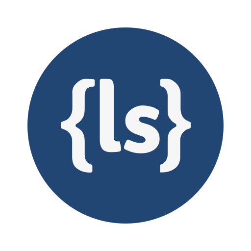

# Compreendendo LESS 


Os pré-processadores são ferramentas que acrescentam funcionalidades extras no CSS, funcionalidades que existem em linguagens de programação.
Funcionalidades como: Variáveis, Funções e Mixins.
Os pré-processadores mais populares são: SASS, Stylus e LESS.
Todos possuem uma pequena diferença na Sintaxe e têm uma ou outra função diferente.
Nesse artigo iremos abordar o LESS.

Todos sabemos que o CSS pode ser um pouco frustrante de escrever, especialmente quando se trata de projetos mais sérios, com milhares de linhas de código. 
Você acaba duplicando as mesmas regras em todo o lugar e usando a pesquisa do seu editor e substituindo a cada mudança de cor. 
É preciso muito esforço e disciplina para manter seu CSS sustentável. Mas não precisa ser assim.

Felizmente, a comunidade de desenvolvimento web resolveu esse problema. Agora temos pré-processadores CSS, como Less, Sass e Stylus. 

Eles nos oferecem vários benefícios sobre o CSS simples:

Variáveis, para que você possa definir e alterar facilmente os valores em toda a folha de estilo. (Isso está chegando ao CSS algum dia.)
Valores calculados dinamicamente. (Em CSS, obtivemos recentemente o calc, mas é apenas para unidades de comprimento.)
Mixins, que permitem reutilizar e combinar estilos. Eles até apoiam argumentos passantes.
Funções, que oferecem vários utilitários úteis para manipulação de cores, conversão de imagens em data-uris e muito mais.
O aspecto negativo é que, se você usar um desses pré-processadores, precisará compilar suas folhas de estilo em CSS regular, para que funcione nos navegadores.


## Tópicos
1.  Linguagem 

    LESS é escrito em JavaScript e precisa do Node.js ou de um navegador da Web para ser executado. 
    Você pode incluir less.js em seu site e ele pode compilar todas as folhas de estilo .less vinculadas em tempo real, mas isso é lento e não é recomendado. 
    A maneira recomendada é compilar suas folhas de estilo com LESS e implantar um arquivo CSS regular online. 
    Existem também vários programas gráficos gratuitos que podem compilar arquivos .less para você, mas neste artigo abordaremos o node.js.
    Se você possui o NODE instalado e sabe o que é um terminal, vá em frente e abra um. Em seguida, instale o LESS usando o NPM:

    npm install -g less

    Isso lhe dará acesso ao comando lessc a partir de qualquer terminal aberto, permitindo que você compile seus arquivos .less no CSS vanilla da seguinte maneira:
    ```js
    lessc styles.less> styles.css
    ```
    Digamos que escrevemos todas as nossas regras de folha de estilo com LESS em styles.less. Com a linha acima, nosso código será transformado em CSS simples em styles.css. 
    Tudo o que resta é vincular esse arquivo css ao nosso HTML. Se houve um erro de compilação, ele aparecerá no seu terminal.


2.  Variáveis

    Um dos principais recursos do Less é a capacidade de criar variáveis ​​como você faria em uma linguagem de programação padrão. 
    Eles podem armazenar qualquer tipo de valor usado com freqüência: cores, dimensões, seletores, nomes de fontes, URLs e assim por diante. 
    A filosofia de less é reutilizar a sintaxe CSS sempre que possível.

    Aqui, definimos duas variáveis, uma para a cor de fundo e outra para a cor do texto, ambas contendo códigos hexadecimais.

    LESS
    ```less
    @background-color: #ffffff;
    @text-color: #1A237E;

    p{
        background-color: @background-color;
        color: @text-color;
        padding: 15px;
    }

    ul{
        background-color: @background-color;
    }

    li{
        color: @text-color;
    }
    ```

    CSS
    ```css
    p{
        background-color: #ffffff;
        color: #1A237E;
        padding: 15px;
    }

    ul{
        background-color: #ffffff;
    }

    li{
        color: #1A237E;
    }
    ```

    No exemplo acima, a cor do plano de fundo é branca, enquanto o texto está escuro. 
    Se quisermos trocá-los e ter elementos escuros com texto em branco, podemos simplesmente alterar os valores das variáveis, em vez de substituir manualmente todas as ocorrências.


3.  Mixins
    LESS nos permite usar uma classe ou IDs existentes e aplicar todos os seus estilos diretamente a outro seletor. O exemplo a seguir esclarecerá as coisas:

    LESS
    ```less
    #circle{
        background-color: #4CAF50;
        border-radius: 100%;
    }

    #small-circle{
        width: 50px;
        height: 50px;
    #circle
    }

    #big-circle{
        width: 100px;
        height: 100px;
    #circle
    }
    ```

    CSS
    ```css
    #circle {
        background-color: #4CAF50;
        border-radius: 100%;
    }
    #small-circle {
        width: 50px;
        height: 50px;
        background-color: #4CAF50;
        border-radius: 100%;
    }
    #big-circle {
        width: 100px;
        height: 100px;
        background-color: #4CAF50;
        border-radius: 100%;
    }
    ```

    Se você não deseja que o mixin apareça como regra no CSS, pode colocar parênteses depois dele:

    LESS
    ```less
    #circle(){
        background-color: #4CAF50;
        border-radius: 100%;
    }

    #small-circle{
        width: 50px;
        height: 50px;
    #circle
    }

    #big-circle{
        width: 100px;
        height: 100px;
    #circle
    }
    ```

    CSS
    ```css
    #small-circle {
        width: 50px;
        height: 50px;
        background-color: #4CAF50;
        border-radius: 100%;
    }
    #big-circle {
        width: 100px;
        height: 100px;
        background-color: #4CAF50;
        border-radius: 100%;
    }
    ```


4.  Aninhamento e escopo
    O aninhamento pode ser usado para estruturar sua folha de estilo de uma maneira que corresponda à estrutura HTML da página, enquanto reduz a chance de conflitos. 

    Abaixo, exemplo de uma lista não ordenada e seus childs:

    LESS
    ```less
    ul{
    background-color: #03A9F4;
    padding: 10px;
    list-style: none;

    li{
        background-color: #fff;
        border-radius: 3px;
        margin: 10px 0;
    }
    }
    ```

    CSS
    ```css
    ul {
    background-color: #03A9F4;
    padding: 10px;
    list-style: none;
    }
    ul li {
    background-color: #fff;
    border-radius: 3px;
    margin: 10px 0;
    }
    ```


5.  Operações
    Você pode executar operações matemáticas básicas com valores e cores numéricos. 
    Digamos que queremos colocar dois divs próximos um do outro, sendo o segundo duas vezes maior e com um fundo diferente. 
    LESS sabe o que são as unidades de medição e não as estraga.

    LESS
    ```css
    @div-width: 100px;
    @color: #03A9F4;

    div{
        height: 50px;
        display: inline-block;
    }

    #left{
        width: @div-width;
        background-color: @color - 100;
    }

    #right{
        width: @div-width * 2;
        background-color: @color;
    }
    ```

    CSS
    ```css
    div {
        height: 50px;
        display: inline-block;
    }
    #left {
        width: 100px;
        background-color: #004590;
    }
    #right {
        width: 200px;
        background-color: #03a9f4;
    }
    ```


6.  Funções
    LESS também possui funções. Vamos dar uma olhada no fadeout, uma função que diminui a opacidade de uma cor.

    LESS
    ```less
    @var: #004590;

    div{
        height: 50px;
        width: 50px;
        background-color: @var;

    &:hover{
        background-color: fadeout(@var, 50%)
    }
    }
    ```

    CSS
    ```css
    div {
        height: 50px;
        width: 50px;
        background-color: #004590;
    }
    div:hover {
        background-color: rgba(0, 69, 144, 0.5);
    }
    ```

    Com o código acima, quando nossa div é suspensa, ela fica parcialmente transparente, tornando as transições do mouse mais fáceis do que nunca. 
    Existem muitas outras funções úteis para manipular cores, detectar o tamanho das imagens e até incorporar recursos como uri de dados na folha de estilo. 

    Leitura Recomendada

    * [Recursos do linguagem](http://lesscss.org/features/#features-overview-feature)
    * [Referência de função](http://lesscss.org/functions/)
    * [Edição e compilação no navegador](http://less2css.org/)


    👤 **Walter Avelino**

    - StackOverFlow [@walteravelino](https://stackoverflow.com/users/13001807/walter-avelino)
    - Github: [@walteravelino](https://github.com/walteravelino)
    - Linkedin: [@walteravelino](https://linkedin.com/in/walter-avelino-434197105)
    - DEV: [@walteravelino](https://dev.to/walteravelino)
